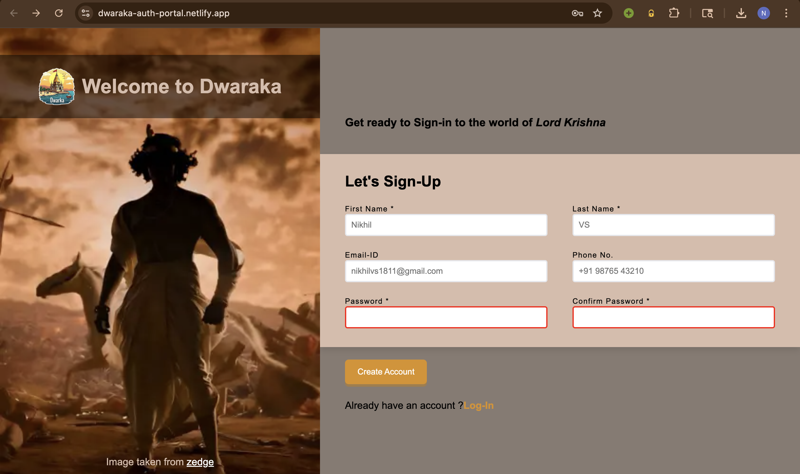
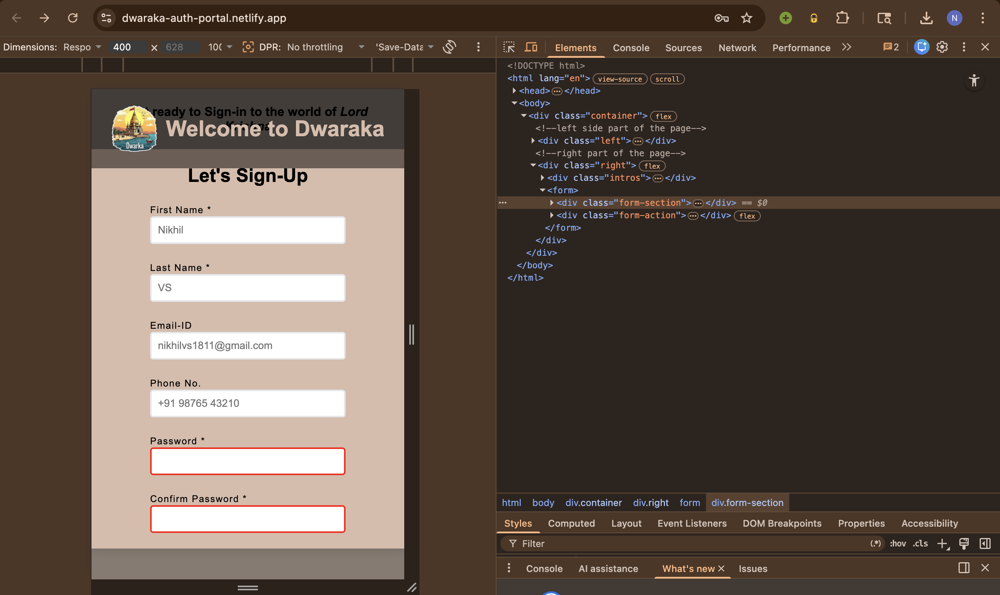

# Dwaraka Auth Portal

A modern, responsive sign-up form inspired by Indian heritage themes.

This project focuses on building clean UI layouts, handling form validation, and creating responsive designs.

---

## 🚀 Live Demo

👉 [Live Demo](https://dwaraka-auth-portal.netlify.app/)

---

## 📸 Screenshots

### Desktop View

### Mobile View

---

## 🛠️ Tech Stack

* HTML5
* CSS3 (Flexbox + Grid)
* Responsive Design

---

## ✨ Features

* Fully responsive layout
* Form validation (HTML5)
* Clean UI design
* Mobile-friendly grid system

---

## 📚 What I Learned

* Flexbox & Grid layout systems
* Positioning (`relative` vs `absolute`)
* Form validation techniques
* Responsive design using media queries

---

## 📦 Deployment

* Hosted on Netlify
* Version controlled using Git & GitHub

---

## 🔗 Project Source

https://github.com/Nikhil-VS1811/dwaraka-auth-portal
